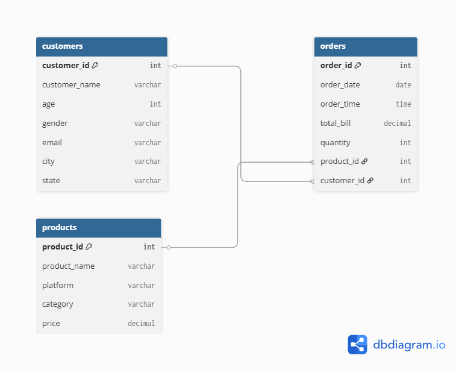

# 🛒 Blinkit vs Zepto SQL Analytics Project

A **SQL-based analytics project** comparing two quick-commerce platforms: **Blinkit** and **Zepto**.  
The project demonstrates **database design, query writing, and business insights** using SQL.

---

## 📑 Table of Contents
- [Introduction](#introduction)
- [Database Schema](#database-schema)
- [Entity-Relationship (ER) Diagram](#entity-relationship-er-diagram)
- [Business Questions & SQL Queries](#business-questions--sql-queries)
- [Sample Outputs](#sample-outputs)
- [Setup & Usage](#setup--usage)
- [Why This Matters](#why-this-matters)
- [Contributing](#contributing)
- [License](#license)
- [Contact](#contact)

---

## 📌 Introduction
Quick-commerce platforms like **Blinkit** and **Zepto** are reshaping how customers buy daily essentials.  
This project builds a **sample SQL database** and answers **13 real-world business questions**, such as:
- Who are the top 5 customers by spend?  
- Which brand performs better across age groups?  
- What product categories drive the most revenue?  

---

## 🗂️ Database Schema

### **Tables**
1. **customers**  
   - `customer_id`, `customer_name`, `age`, `gender`, `email`, `city`, `state`

2. **products**  
   - `product_id`, `product_name`, `platform (Zepto/Blinkit)`, `category`, `price`

3. **orders**  
   - `order_id`, `order_date`, `order_time`, `total_bill`, `quantity`, `product_id`, `customer_id`

---

## 🖇️ Entity-Relationship (ER) Diagram

---

## 💡 Business Questions & SQL Queries

The project answers **13 business questions** using SQL:

1. Top 5 customers by spend  
2. Which age group + brand generates the highest revenue  
3. Most ordered product categories by brand  
4. Age group-wise revenue split (young vs senior)  
5. Top 3 selling products in each brand  
6. Product categories exclusive to Zepto  
7. Year-wise revenue comparison between brands  
8. Top 3 cities by orders  
9. Bottom 3 states by revenue  
10. Month & Year-wise revenue trend  
11. Weekend sales by brand  
12. Customers with > 2 orders per brand  
13. Total repeat orders (brand-wise)  

👉 All queries are stored inside [`Blinkit_vs_zepto_project_row_queries.sql`](Blinkit_vs_zepto_project_row_queries.sql)

---

## 📊 Sample Outputs

Here are **example results** from the queries:

### 🔹 Top 3 Customers by Spend
| Customer Name | Total Spent |
|---------------|-------------|
| Ravi Kumar    | 500         |
| Priya Singh   | 450         |
| Amit Sharma   | 220         |

---

### 🔹 Age Group + Platform Revenue
| Age Group   | Platform | Revenue |
|-------------|----------|---------|
| Middle-aged | Zepto    | 750     |

---

### 🔹 Top 3 Products per Platform
| Platform | Product    | Revenue |
|----------|------------|---------|
| Zepto    | Rice 5kg   | 400     |
| Zepto    | Detergent  | 250     |
| Blinkit  | Apples 1kg | 240     |

---

### 🔹 Weekend Sales by Brand
| Platform | Weekend Sales |
|----------|---------------|
| Zepto    | 390           |
| Blinkit  | 310           |

---

### 🔹 Year-wise Revenue Comparison
| Year | Platform | Revenue |
|------|----------|---------|
| 2024 | Zepto    | 870     |
| 2024 | Blinkit  | 730     |

---

## 📎 Project Author

**Kapil Saran**  
📧 Email: sarankapil146@gmail.com  
🔗 [LinkedIn](www.linkedin.com/in/kapil-saran-5772j48)  
🛠️ Tools: Python, SQL, MySQL

---

## 🌟 If You Like This Project

- ⭐ Star this repo on GitHub  
- 💬 Share feedback or connect on LinkedIn  
